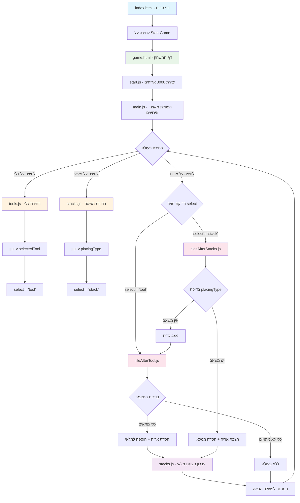
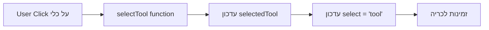
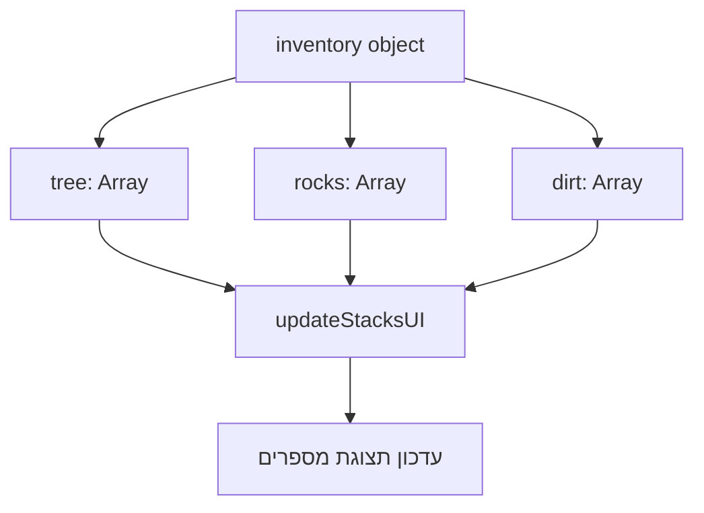
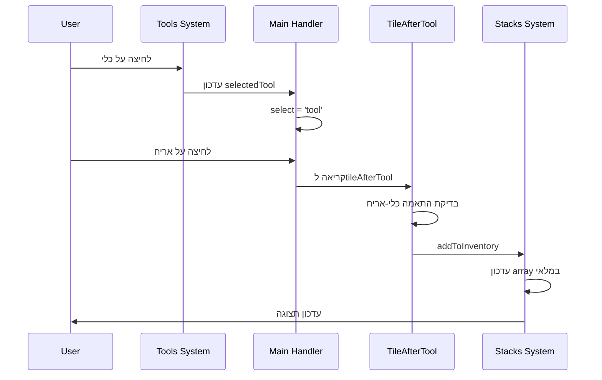
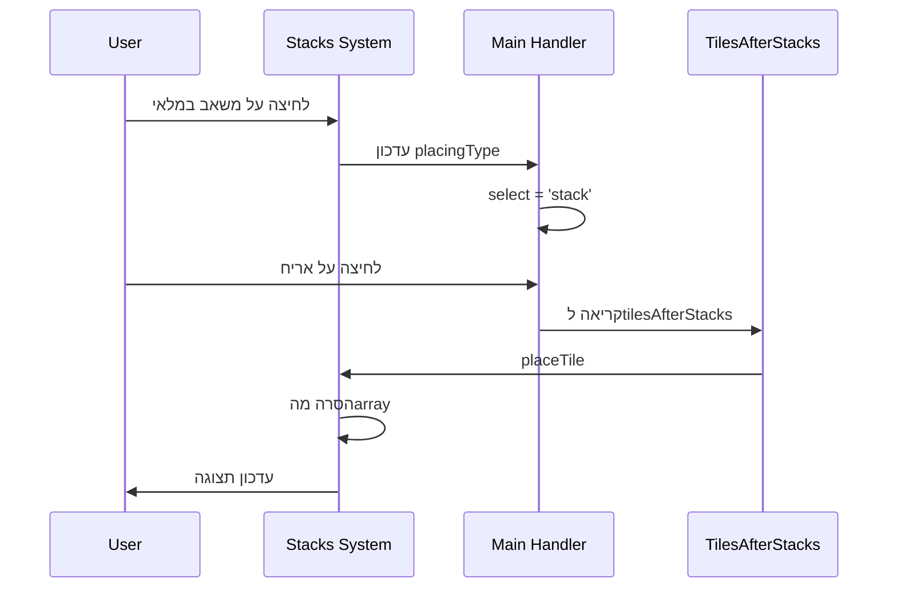

# Minecraft Browser Game

משחק מיינקרפט דו-ממדי פשוט המפותח ב-HTML, CSS ו-JavaScript. המשחק מאפשר לשחקנים לכרות משאבים, לאגור אותם ולבנות בעולם וירטואלי.

## 🎮 תכונות המשחק

- **עולם 2D**: רשת של 3000 אריחים הכוללת שמיים, עפר, אבנים ועצים
- **מערכת כלים**: שלושה כלים לכריית משאבים שונים:
  - 🪓 גרzen - לכריתת עצים
  - ⛏️ מכוש - לכריית אבנים
  - 🏗️ את - לחפירת עפר
- **מערכת משאבים**: אגירה וספירה של משאבים שנכרו
- **מערכת בנייה**: הצבת משאבים חזרה בעולם

## 📁 מבנה הפרויקט

```
minecraft-game/
├── index.html              # דף הבית עם כפתור התחלה
├── pages/
│   └── game.html           # דף המשחק הראשי
├── scripts/
│   ├── main.js            # קובץ הקואורדינציה הראשי
│   ├── start.js           # יצירת עולם המשחק
│   ├── tools.js           # מערכת הכלים
│   ├── stacks.js          # מערכת המלאי
│   ├── tiles.js           # טיפול באירועי קליק על אריחים
│   ├── tileAfterTool.js   # לוגיקת כריית משאבים
│   └── tilesAfterStacks.js # לוגיקת הצבת משאבים
└── styles/
    ├── style.css          # עיצוב דף הבית
    └── default.css        # עיצוב המשחק
```

## 🎯 איך לשחק

### התחלה
1. פתח את `index.html` בדפדפן
2. לחץ על "Start Game"
3. תועבר לדף המשחק

### בחירת כלים
- לחץ על אחד מהכלים בצד השמאלי:
  - **גרzen** - לכריתת עצים
  - **מכוש** - לכריית אבנים
  - **את** - לחפירת עפר

### כריית משאבים
1. בחר כלי מתאים
2. לחץ על האריח הרצוי כדי לכרות
3. המשאב יתווסף למלאי

### בנייה
1. לחץ על המשאב במלאי (מספרים בצד)
2. לחץ על אריח ריק כדי להציב את המשאב

## 🏗️ ארכיטקטורת הקוד

### קבצי JavaScript

#### `main.js` - קואורדינציה ראשית
- מייבא את כל המודולים
- מטפל באירועי קליק על כלים ומלאי
- מנהל את מצב המשחק הכללי

#### `start.js` - יצירת העולם
- יוצר 3000 אריחים
- מגדיר שכבות: שמיים (0-999), עפר (1000-1999), אבנים (2000-2999)
- מציב עצים במיקומים מוגדרים מראש

#### `tools.js` - מערכת כלים
- שומר את הכלי הנבחר
- מספק פונקציות לבחירה וקריאה של כלים

#### `stacks.js` - מערכת מלאי
- מנהל אובייקט מלאי עם משאבים
- מעדכן תצוגת המלאי
- מספק פונקציות להוספה והצבת משאבים

#### `tiles.js` - טיפול בקליקים
- מפנה קליקים לפונקציות המתאימות
- מבחין בין מצב כריה למצב בנייה

#### `tileAfterTool.js` - לוגיקת כריה
- בודק התאמה בין כלי לאריח
- מסיר אריחים ומוסיף למלאי

#### `tilesAfterStacks.js` - לוגיקת בנייה
- מטפל בהצבת משאבים מהמלאי
- כולל גם פונקציונליות כריה חלופית

## 🎨 עיצוב ותצוגה

### CSS Structure
- **Grid Layout**: המשחק משתמש ב-CSS Grid ליצירת רשת אריחים
- **Background Images**: כל סוג אריח וכלי משתמש בתמונת רקע
- **Responsive Design**: המשחק מותאם למסכים שונים
- **Hover Effects**: אפקטים ויזואליים לאינטראקטיביות

### Assets Required
המשחק מצפה לתמונות בתיקייה `assets/images/`:
- `axe.webp` - תמונת גרzen
- `shovel.webp` - תמונת את
- `pickaxe.webp` - תמונת מכוש
- `dirt.webp` - תמונת עפר
- `stone.webp` - תמונת אבן
- `tree.webp` - תמונת עץ
- `minecraft.jpeg` - רקע דף הבית

## 🔧 טכנולוגיות

- **HTML5**: מבנה בסיסי
- **CSS3**: עיצוב ואנימציות
- **Vanilla JavaScript**: לוגיקת משחק
- **ES6 Modules**: ארגון קוד מודולרי

## 🚀 הרצה מקומית

1. הורד את כל הקבצים
2. ודא שתיקיית `assets/images/` מכילה את כל התמונות הנדרשות
3. פתח את `index.html` בדפדפן
4. התחל לשחק!

## 🎯 תכונות עתידיות אפשריות

- [ ] שמירה וטעינה של עולם המשחק
- [ ] יותר סוגי משאבים וכלים
- [ ] מערכת קרפטינג
- [ ] מפות גדולות יותר
- [ ] מצב מולטיפלייר
- [ ] מערכת הישרדות (רעב, בריאות)
- [ ] יצורים ו-NPCs

## 🐛 בעיות ידועות

- המשחק לא שומר התקדמות בין סשנים
- אין אפשרות לשנות גודל מפה
- חוסר תמיכה במכשירים ניידים

## 📊 תרשים זרימה



## 🔄 זרימת נתונים מפורטת

### מבנה מערכת הכלים


### מבנה מערכת המלאי


### מחזור כריה מלא


### מחזור בנייה מלא


## 📝 רישיון

פרויקט חינמי ופתוח לשימוש אישי וחינוכי.
